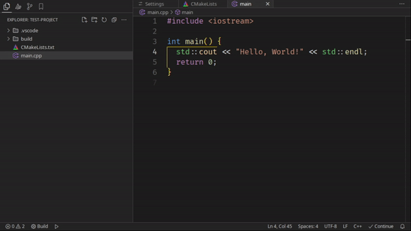

# cmake-build

This extension is a wrapper for the [CMake Tools](https://marketplace.visualstudio.com/items?itemName=ms-vscode.cmake-tools) extension by Microsoft.

This wrapper adds more feedback from CMake, like show notifications when build failed or succeeded.

## Features
- Notify when build failed or succeeded.
- Open CMake output on failed builds.

(All of them are configurable)

## Usage
1. Install the [CMake Tools](https://marketplace.visualstudio.com/items?itemName=ms-vscode.cmake-tools) extension;
2. Install this extension;
3. Configure your shortcuts to call CMake commands via this extension:
    - `cmake-build: Build` (default shortcut is `Ctrl+B`);
    - `cmake-build: Install` (default shortcut is `F8`);
    - `cmake-build: Clean`
    - `cmake-build: Configure`
    - `cmake-build: Reconfigure`
4. Enjoy!